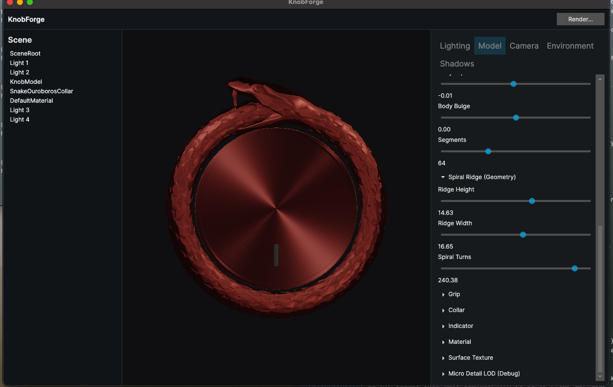

# KnobForge

A 3D tool for designing and texturing skeuomorphic UI components like knobs, dials, and buttons. KnobForge provides a real-time 3D environment to import models, define materials, set up complex lighting, and paint directly on the model to achieve detailed weathering effects.



## Core Features

*   **3D Model Import:** Import custom models in `.stl` and `.glb` formats to use as the base for your component.
*   **Advanced Lighting:** A flexible lighting system with multiple configurable point lights, environment lighting, and detailed shadow controls.
*   **Physically-Based Materials:** Adjust material properties like base color, metallic, roughness, and pearlescence to create realistic surfaces.
*   **Texture Painting:** Paint directly onto the 3D model using a channel-based system for effects like `Rust`, `Wear`, `Gunk`, and `Scratches`.
*   **Procedural Brushes:** A variety of brush types are available, including `Spray`, `Splat`, and `Scuff`, which use procedural generation for organic-looking strokes.
*   **Real-time 3D Viewport:** See the results of your work immediately in a live-rendered 3D viewport.

## Example Output

The tool can be used to generate spritesheets of rendered knobs for use in UIs.


## Getting Started

### Prerequisites

*   [.NET 8 SDK](https://dotnet.microsoft.com/download/dotnet/8.0)

### Building

Clone the repository and run the following command from the root directory to build the entire solution:

```bash
dotnet build KnobForge.sln
```

### Running the Application

To launch the KnobForge application, run the following command:

```bash
dotnet run --project KnobForge.App/KnobForge.App.csproj
```

#### Note for macOS Users

KnobForge enforces GPU rendering on macOS and defaults to Metal:

```bash
export KNOBFORGE_RENDER_MODE=metal
dotnet run --project KnobForge.App/KnobForge.App.csproj
```

### macOS App Bundle, Icon, Installer, and Signing

Local desktop update flow (no Apple Developer account required):

```bash
cd /Users/main/Desktop/KnobForge
APP_ICON_SOURCE=/Users/main/Desktop/KnobForge/icon.ico \
APP_SIGN_IDENTITY=- \
CODESIGN_ENABLED=1 \
REGISTER_LAUNCH_SERVICES=0 \
RESTORE=1 \
bash scripts/macos/build-app-bundle.sh
mkdir -p /Users/main/Applications
rsync -a artifacts/macos/KnobForge.app /Users/main/Applications/
xattr -dr com.apple.quarantine /Users/main/Applications/KnobForge.app
open /Users/main/Applications/KnobForge.app
```

Optional icon fallback (only if the app icon does not show correctly):

```bash
python3 - <<'PY'
from PIL import Image
src='/Users/main/Desktop/KnobForge/icon.ico'
dst='/Users/main/Desktop/KnobForge/artifacts/macos/KnobForge.app/Contents/Resources/KnobForge.icns'
img=Image.open(src)
img.save(dst, format='ICNS', sizes=[(16,16),(32,32),(64,64),(128,128),(256,256),(512,512),(1024,1024)])
print("wrote:", dst)
PY
codesign --force --deep --sign - /Users/main/Desktop/KnobForge/artifacts/macos/KnobForge.app
rsync -a /Users/main/Desktop/KnobForge/artifacts/macos/KnobForge.app /Users/main/Applications/
```

Build a full macOS `.app` bundle (with `.knob` file association metadata and app icon generation):

```bash
bash scripts/macos/build-app-bundle.sh
```

This produces:

```text
artifacts/macos/KnobForge.app
```

Important build variables:

```bash
APP_VERSION=1.2.0 \
BUILD_NUMBER=120 \
BUNDLE_IDENTIFIER=com.knobforge.app \
APP_ICON_SOURCE=/Users/main/Desktop/KnobForge/icon.ico \
APP_SIGN_IDENTITY="Developer ID Application: Your Name (TEAMID)" \
bash scripts/macos/build-app-bundle.sh
```

By default, signing uses `/Users/main/Desktop/KnobForge/KnobForge.App/entitlements.macos.plist`. Override with `ENTITLEMENTS_PATH=/path/to/entitlements.plist` if needed.

Create a macOS installer package:

```bash
INSTALLER_SIGN_IDENTITY="Developer ID Installer: Your Name (TEAMID)" \
bash scripts/macos/build-installer-pkg.sh
```

This produces:

```text
artifacts/macos/KnobForge-<version>.pkg
```

Notarize and staple (optional but recommended for distribution outside your machine):

```bash
NOTARYTOOL_PROFILE=knobforge-notary \
NOTARIZE_TARGET=pkg \
PKG_PATH=/Users/main/Desktop/KnobForge/artifacts/macos/KnobForge-1.2.0.pkg \
bash scripts/macos/notarize-release.sh
```

Set `.knob` as default in Finder:

1. Select any `.knob` file.
2. `Get Info` -> `Open with` -> choose `KnobForge.app`.
3. Click `Change All...`.

## How to Use

1.  **Launch the application.** It will load a default project with an Ouroboros ring model.
2.  **Adjust Lighting:** Use the light controls in the UI to move lights, change their color, and adjust intensity.
3.  **Edit Materials:** Select the `CollarNode` or `MaterialNode` in the scene hierarchy to access and modify material properties in the inspector.
4.  **Paint Textures:**
    *   Enable the **Brush Painting** toggle.
    *   Select a **Paint Channel** (e.g., `Rust`, `Wear`). If you select the `Color` channel, a dedicated color picker will appear in the "Brush Controls" tab.
    *   Choose a **Brush Type** and configure its settings (size, opacity, etc.).
    *   Click and drag on the 3D model in the viewport to paint.
5.  **Advanced Brush Controls:** Right-click within the 3D viewport to access a context menu that allows you to invert the brush direction along the X, Y, or Z (depth) axes. The Y-axis is inverted by default for more natural "up and down" painting.
6.  **Export:** Once you are happy with the result, use the export functionality to save out the generated texture maps.

## Native Dependencies

If you encounter a `DllNotFoundException` or similar issues related to `libSkiaSharp.so` or other native binaries when running on a different OS, you may need to install the appropriate native assets package for your platform. For example, for a generic Linux distribution:

```bash
dotnet add package SkiaSharp.NativeAssets.Linux.NoDependencies
```

Replace `Linux` with your target platform (e.g., `Windows`, `macOS`). The correct package for macOS was likely installed automatically as a dependency.
